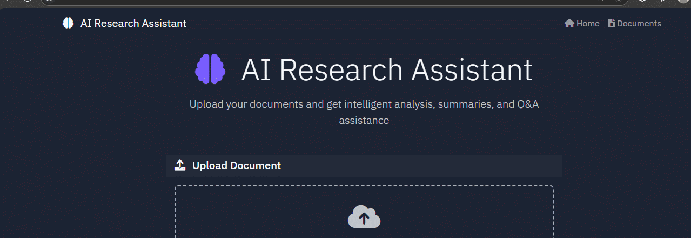

# AI Research Assistant

A Flask-based AI research assistant that provides comprehensive document analysis, summarization, and intelligent Q&A capabilities using local CPU-friendly models.




## Features

- **Document Upload**: Support for PDF and TXT files (up to 16MB)
- **Auto-Summary**: Instant document summarization (≤150 words)
- **Ask Anything Mode**: Free-form questions with contextual answers
- **Challenge Mode**: AI-generated comprehension questions with evaluation
- **Document-Grounded Responses**: All answers include justifications and source references
- **Memory Handling**: Context-aware follow-up questions
- **Answer Highlighting**: Display relevant document snippets
- **CPU-Optimized**: Works without GPU using quantized models

## Tech Stack

### Backend
- **Flask**: Python web framework
- **llama-cpp-python**: Local CPU-friendly LLM inference
- **sentence-transformers**: Document embeddings (all-MiniLM-L6-v2)
- **FAISS**: Vector similarity search
- **PyPDF2**: PDF text extraction
- **SQLAlchemy**: Database ORM

### Frontend
- **HTML5/CSS3/JavaScript**: Modern web technologies
- **Bootstrap 5**: Responsive UI framework
- **Font Awesome**: Icons
- **Fetch API**: Asynchronous communication

### AI Models
- **Quantized Llama**: GGUF format for CPU inference
- **Sentence Transformers**: Lightweight embeddings model

### Project structure  


## Quick Start

### Prerequisites
- Python 3.11 or higher
- 4GB+ RAM (8GB+ recommended)
- 2GB+ storage space

### Installation
```bash
# 1. Download and open the project in VSCode
# 2. Open terminal in VSCode (Ctrl+`)

# 3. Install dependencies
pip install flask flask-sqlalchemy gunicorn PyPDF2 numpy psycopg2-binary email-validator werkzeug sqlalchemy

# 4. Create required folders
mkdir uploads models_cache

# 5. Run the application
python main.py

# 6. Open browser to http://localhost:5000
```

### Detailed Setup
See [setup_guide.md](setup_guide.md) for complete step-by-step instructions.
